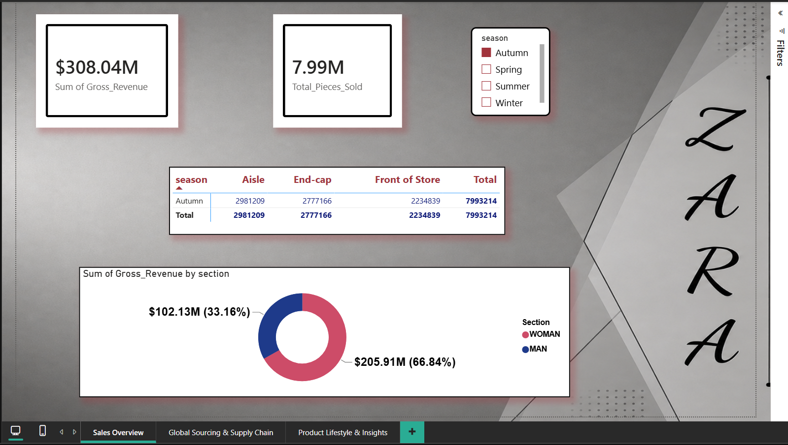
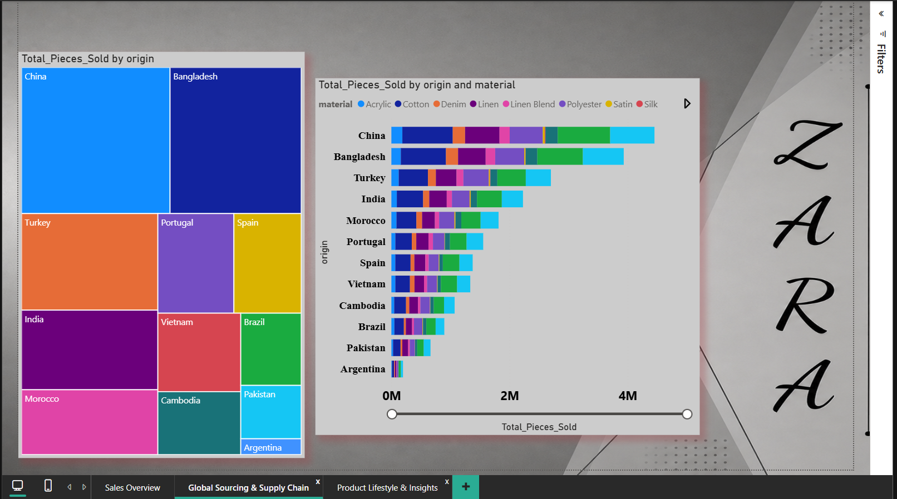
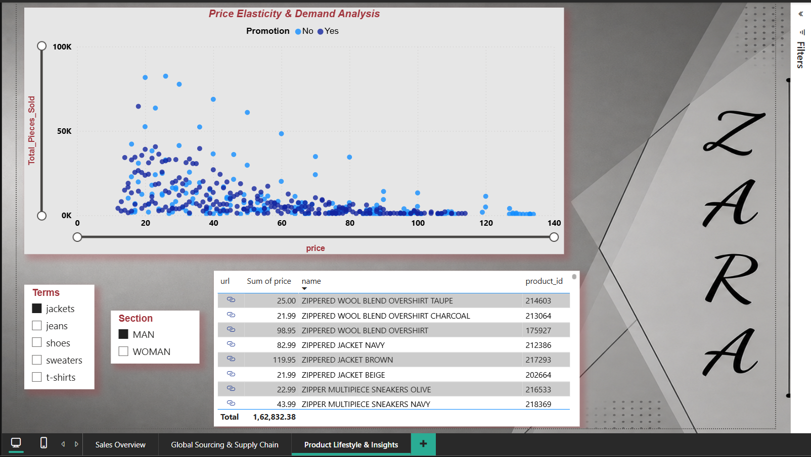

# 📊 Zara Commercial Diagnostics & Analytics

This is a data analytics project for *ZARA Company.* I used *SQL* to clean the raw data and built a *3-Page Power BI Dashboard* to help the company make better business decisions.

## 📁 Dashboard Pages & Business Insights

### 1. Sales Overview
* **What it shows:** Total money made ($308.04M) and total clothes sold (7.99M).
* **Core Insight (Visual Merchandising & Seasonality):** The data proves that the *Autumn Season* is the absolute sales peak for the business. It proves that putting clothes in the "Aisle" (walking passages between shelves) makes more sales during peak seasons as compared to the traditional 'Front of Store' visual merchandising.

### 2. Supply Chain & Sourcing Risk
* *What it shows:* From where ZARA gets its materials globally and the distribution of these sourcing hubs.
* *Core Insight (Sourcing Concentration):* It alerts the management that China and Bangladesh supply more than 65% of all raw materials for Zara's products. This means if anything happens in these two countries, Zara's supply chain will get stuck due to heavy sourcing concentration.

### 3. Product & Catalog Insights
* **What it shows:** Pricing strategy and discount performance.
* **Core Insight (The Promotion Paradox):** It reveals that giving discounts didn't help ZARA in selling old or out of trend products. ZARA's Customers prefer buying new designs and trendy products at full price (between $20 and $40).
* **Live Sync:** Merchandisers can click on the live web links directly inside the table to see the product on the live website instantly.

### 🎯 Simple ZARA Business Solutions by GIRISHMA:
*Visual Merchandising:*  Shift maximum inventory to 'Aisle' layouts during the Autumn peak to get more sales.

*Supply Chain:* Zara gets 65% of its materials from only China and Bangladesh. To reduce this risk, Zara should start sourcing materials from other countries too, so the supply chain never stops.

*Pricing Strategy:*  Giving big discounts on old or out of trend clothes is not working. Instead, focus on fresh and trendy designs and sell them at the normal $20 to $40 price range, because customers love buying them at full price.
